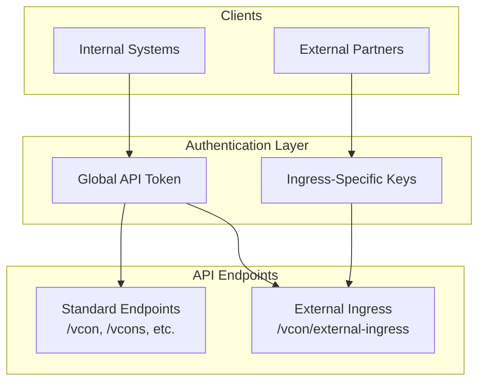
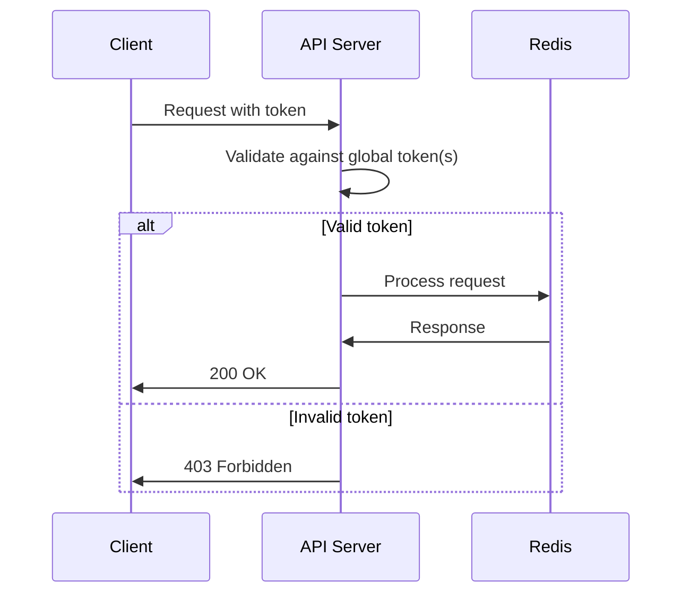
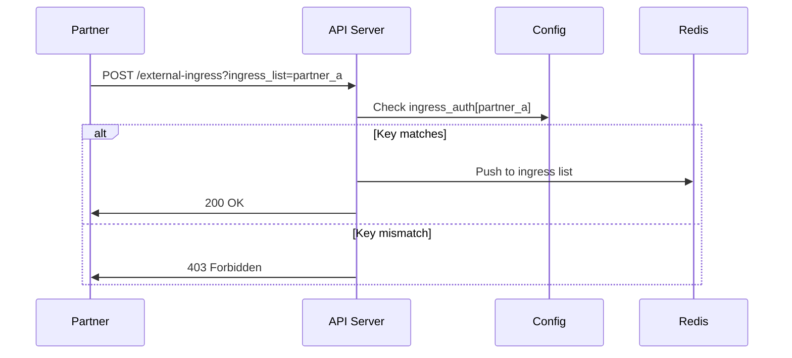

# Authentication

vCon Server supports multiple authentication mechanisms for securing API access.

## Authentication Overview



## Global API Token

The global API token provides full access to all endpoints.

### Configuration

**Environment Variable:**

```bash
CONSERVER_API_TOKEN=your-secure-token-here
```

**Token File (multiple tokens):**

```bash
CONSERVER_API_TOKEN_FILE=/etc/vcon/api_tokens.txt
```

Token file format (one token per line):

```
admin-token-abc123
service-token-def456
readonly-token-ghi789
```

### Usage

Include the token in requests:

```bash
curl http://api/vcon \
  -H "x-conserver-api-token: your-secure-token-here"
```

### Custom Header Name

Change the header name if needed:

```bash
CONSERVER_HEADER_NAME=Authorization
```

Then use:

```bash
curl http://api/vcon \
  -H "Authorization: Bearer your-token"
```

## Ingress-Specific Authentication

For external integrations, use scoped API keys that only allow access to specific ingress lists.

### Configuration

In `config.yml`:

```yaml
ingress_auth:
  # Single key for an ingress list
  partner_a_input: "partner-a-api-key-12345"
  
  # Multiple keys for an ingress list
  partner_b_input:
    - "partner-b-primary-key"
    - "partner-b-backup-key"
    - "partner-b-dev-key"
```

### Usage

External partners use the `/vcon/external-ingress` endpoint:

```bash
curl -X POST "http://api/vcon/external-ingress?ingress_list=partner_a_input" \
  -H "x-conserver-api-token: partner-a-api-key-12345" \
  -H "Content-Type: application/json" \
  -d '{"vcon": "0.0.1", "uuid": "...", ...}'
```

### Security Benefits

- Partners can only submit to their assigned ingress list
- Key compromise affects only that partner's access
- Easy to rotate individual keys without affecting others
- Audit trail per partner

## Authentication Flow

### Standard Endpoints



### External Ingress



## Token Management

### Generating Secure Tokens

```bash
# Generate a 32-byte (256-bit) hex token
openssl rand -hex 32

# Generate a base64 token
openssl rand -base64 32

# Generate using Python
python -c "import secrets; print(secrets.token_hex(32))"
```

### Token Rotation

**Step 1: Add New Token**

Add the new token to the token file:

```bash
echo "new-token-xyz789" >> /etc/vcon/api_tokens.txt
```

Or add to environment:

```bash
# In .env, you can only have one token via env var
# Use CONSERVER_API_TOKEN_FILE for multiple tokens
```

**Step 2: Update Clients**

Update clients to use the new token.

**Step 3: Remove Old Token**

Remove the old token from the file:

```bash
# Edit the file and remove the old token
nano /etc/vcon/api_tokens.txt
```

**Step 4: Restart (if using env var)**

If using `CONSERVER_API_TOKEN`, restart the service:

```bash
docker compose restart api
```

### Key Rotation for Ingress Auth

Update `config.yml`:

```yaml
ingress_auth:
  partner_a_input:
    - "new-partner-a-key"      # New key
    - "old-partner-a-key"      # Keep old key temporarily
```

After partner updates:

```yaml
ingress_auth:
  partner_a_input: "new-partner-a-key"  # Remove old key
```

## Security Best Practices

### 1. Use Strong Tokens

```bash
# Minimum 32 bytes (256 bits)
openssl rand -hex 32
```

### 2. Separate Environments

```bash
# Development
CONSERVER_API_TOKEN=dev-token-not-secure

# Production
CONSERVER_API_TOKEN=prod-token-very-secure-random-string
```

### 3. Use Token Files in Production

```bash
# Better than environment variables
CONSERVER_API_TOKEN_FILE=/etc/vcon/api_tokens.txt

# Secure the file
chmod 600 /etc/vcon/api_tokens.txt
chown vcon:vcon /etc/vcon/api_tokens.txt
```

### 4. Use Ingress Auth for Partners

```yaml
# Give each partner their own key
ingress_auth:
  acme_corp: "acme-unique-key"
  globex: "globex-unique-key"
```

### 5. Monitor Authentication Failures

Check logs for failed authentication attempts:

```bash
docker compose logs api | grep -i "403\|forbidden\|unauthorized"
```

### 6. Use HTTPS

Always use HTTPS in production:

```yaml
# nginx.conf
server {
    listen 443 ssl;
    ssl_certificate /etc/ssl/certs/vcon.crt;
    ssl_certificate_key /etc/ssl/private/vcon.key;
    
    location /api {
        proxy_pass http://api:8000;
    }
}
```

### 7. Rate Limiting

Add rate limiting at the reverse proxy level:

```yaml
# nginx rate limiting
limit_req_zone $binary_remote_addr zone=api:10m rate=10r/s;

server {
    location /api {
        limit_req zone=api burst=20 nodelay;
        proxy_pass http://api:8000;
    }
}
```

## Troubleshooting

### 403 Forbidden

**Check token is set:**

```bash
# In container
docker compose exec api env | grep CONSERVER_API_TOKEN
```

**Check header name:**

```bash
# Default header
curl -H "x-conserver-api-token: $TOKEN" ...

# Custom header
curl -H "$CUSTOM_HEADER: $TOKEN" ...
```

**Check ingress auth:**

```bash
# View current config
curl http://api/config -H "x-conserver-api-token: $ADMIN_TOKEN" | jq .ingress_auth
```

### Token File Not Loading

**Check file exists and readable:**

```bash
ls -la /etc/vcon/api_tokens.txt
cat /etc/vcon/api_tokens.txt
```

**Check file format:**

- One token per line
- No trailing spaces
- No empty lines

### External Ingress Rejected

**Verify ingress list name matches:**

```bash
# Request must match config exactly
curl "...?ingress_list=partner_a_input"  # Must match key in ingress_auth
```

**Check key is in list:**

```yaml
ingress_auth:
  partner_a_input:
    - "the-key-you-are-using"  # Must be in this list
```
