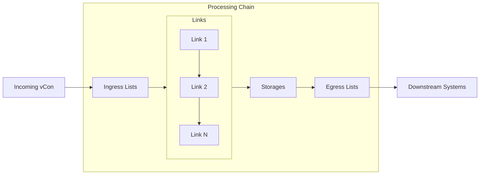

# Chains and Pipelines

Chains are the core processing unit in vCon Server. They define how vCons flow through the system.

## Chain Anatomy



## Chain Configuration

### Basic Structure

```yaml
chains:
  chain_name:
    links:
      - link1
      - link2
    storages:
      - storage1
    ingress_lists:
      - input_queue
    egress_lists:
      - output_queue
    tracers:
      - tracer1
    enabled: 1
```

### Required Fields

| Field | Description |
|-------|-------------|
| `links` | List of processing links (can be empty) |
| `storages` | List of storage backends |
| `ingress_lists` | List of input queue names |
| `enabled` | `1` to enable, `0` to disable |

### Optional Fields

| Field | Description |
|-------|-------------|
| `egress_lists` | Output queues for downstream processing |
| `tracers` | Audit trail tracers |

## Processing Flow

### 1. Ingress

vCons enter the chain through ingress lists:

```yaml
ingress_lists:
  - main_input
  - partner_input
  - api_input
```

Multiple chains can share ingress lists, but each vCon is processed by only one chain (first match).

### 2. Link Execution

Links execute sequentially in order:

```yaml
links:
  - transcribe      # Step 1: Transcribe audio
  - analyze         # Step 2: AI analysis
  - tag             # Step 3: Apply tags
  - tag_router      # Step 4: Route based on tags
```

Each link:

1. Receives the vCon UUID
2. Retrieves the vCon from Redis
3. Processes/transforms the vCon
4. Stores the updated vCon
5. Returns the UUID (or `None` to filter)

### 3. Storage

After all links complete, the vCon is saved to all configured storages:

```yaml
storages:
  - postgres       # Primary storage
  - s3             # Archive
  - elasticsearch  # Search index
```

With `CONSERVER_PARALLEL_STORAGE=true`, writes happen concurrently.

### 4. Egress

Finally, the vCon UUID is pushed to egress lists:

```yaml
egress_lists:
  - processed_queue
  - analytics_queue
```

## Link Configuration

### Static Configuration

Define link options in the `links` section:

```yaml
links:
  my_link:
    module: links.analyze
    options:
      model: gpt-4
      temperature: 0.3
```

Reference in chains:

```yaml
chains:
  my_chain:
    links:
      - my_link
```

### Inline Configuration

Override options inline in the chain:

```yaml
chains:
  my_chain:
    links:
      - analyze:
          model: gpt-3.5-turbo
          temperature: 0.7
```

### Mixed Configuration

Combine predefined links with inline overrides:

```yaml
links:
  base_transcribe:
    module: links.deepgram_link
    options:
      model: nova-2

chains:
  english_chain:
    links:
      - base_transcribe:
          language: en
  
  spanish_chain:
    links:
      - base_transcribe:
          language: es
```

## Filtering

Links can filter vCons from the pipeline by returning `None`:

```yaml
links:
  sampler:
    module: links.sampler
    options:
      rate: 0.1  # Only process 10% of vCons
```

When a link returns `None`:

1. Processing stops for that vCon
2. No storage operations occur
3. No egress push happens
4. The vCon remains in Redis

## Routing

Use `tag_router` to route vCons to different queues:

```yaml
links:
  tag_router:
    module: links.tag_router
    options:
      rules:
        - tag: urgent
          queue: urgent_processing
        - tag: routine
          queue: routine_processing
        - tag: archive
          queue: archive_only
```

The router:

1. Checks vCon tags against rules
2. Pushes to matching queues
3. Multiple rules can match

## Common Patterns

### Transcription Pipeline

```yaml
chains:
  transcription:
    links:
      - deepgram_link:
          model: nova-2
          diarize: true
    storages:
      - postgres
    ingress_lists:
      - audio_input
    egress_lists:
      - transcribed
    enabled: 1
```

### Analysis Pipeline

```yaml
chains:
  analysis:
    links:
      - analyze:
          model: gpt-4
          prompt: |
            Analyze this conversation and provide:
            1. Summary
            2. Key topics
            3. Action items
            4. Sentiment
    storages:
      - postgres
      - elasticsearch
    ingress_lists:
      - transcribed
    egress_lists:
      - analyzed
    enabled: 1
```

### Multi-Stage Pipeline

```yaml
chains:
  stage1_transcribe:
    links:
      - deepgram_link
    storages:
      - redis_storage
    ingress_lists:
      - raw_audio
    egress_lists:
      - stage2_input
    enabled: 1

  stage2_analyze:
    links:
      - analyze
      - detect_engagement
    storages:
      - redis_storage
    ingress_lists:
      - stage2_input
    egress_lists:
      - stage3_input
    enabled: 1

  stage3_store:
    links:
      - tag
    storages:
      - postgres
      - s3
    ingress_lists:
      - stage3_input
    enabled: 1
```

### Conditional Processing

```yaml
chains:
  triage:
    links:
      - check_and_tag:
          rules:
            - condition: duration > 300
              tag: long_call
            - condition: has_escalation
              tag: escalated
      - tag_router:
          rules:
            - tag: escalated
              queue: urgent_review
            - tag: long_call
              queue: detailed_analysis
    storages:
      - redis_storage
    ingress_lists:
      - incoming
    enabled: 1
```

### Archive-Only

```yaml
chains:
  archive:
    links: []  # No processing
    storages:
      - s3:
          s3_path: archive/
    ingress_lists:
      - archive_input
    enabled: 1
```

### Sampling for QA

```yaml
chains:
  qa_sample:
    links:
      - sampler:
          rate: 0.05  # 5% sample
      - tag:
          tags: [qa_review]
    storages:
      - postgres
    ingress_lists:
      - all_calls
    egress_lists:
      - qa_queue
    enabled: 1
```

## Error Handling

### Dead Letter Queue

When processing fails, vCons go to the Dead Letter Queue:

```
DLQ:{ingress_list_name}
```

Monitor and reprocess:

```bash
# View DLQ contents
curl "http://api/dlq?ingress_list=main_input" \
  -H "x-conserver-api-token: $TOKEN"

# Reprocess DLQ
curl -X POST "http://api/dlq/reprocess?ingress_list=main_input" \
  -H "x-conserver-api-token: $TOKEN"
```

### Tracer Integration

Use tracers to track processing:

```yaml
chains:
  audited_chain:
    links:
      - transcribe
      - analyze
    storages:
      - postgres
    tracers:
      - jlinc  # Audit trail
    ingress_lists:
      - regulated_input
    enabled: 1
```

## Best Practices

### 1. Keep Chains Focused

Each chain should have a clear purpose:

```yaml
# Good: Single responsibility
chains:
  transcription:
    links: [deepgram_link]
    ...
  
  analysis:
    links: [analyze, tag]
    ...

# Avoid: Too many responsibilities
chains:
  everything:
    links: [transcribe, analyze, tag, webhook, email, archive]
    ...
```

### 2. Use Meaningful Names

```yaml
# Good
chains:
  customer_support_transcription:
    ingress_lists: [support_calls]
    ...

# Avoid
chains:
  chain1:
    ingress_lists: [list1]
    ...
```

### 3. Plan Storage Strategy

```yaml
# Hot data: Fast access
storages:
  - postgres       # Queries
  - elasticsearch  # Search

# Cold data: Archive
storages:
  - s3            # Long-term storage
```

### 4. Test Chains Individually

```yaml
# Development chain for testing
chains:
  test_chain:
    links:
      - my_new_link
    storages:
      - redis_storage
    ingress_lists:
      - test_input
    enabled: 1
```

## Troubleshooting

### Chain Not Processing

1. Check `enabled: 1`
2. Verify ingress list matches submission
3. Check for DLQ entries
4. Review worker logs

### Slow Processing

1. Review link complexity
2. Check external API latency
3. Enable parallel storage
4. Scale workers

### Missing Output

1. Check link isn't filtering (`return None`)
2. Verify storage configuration
3. Check egress list names
