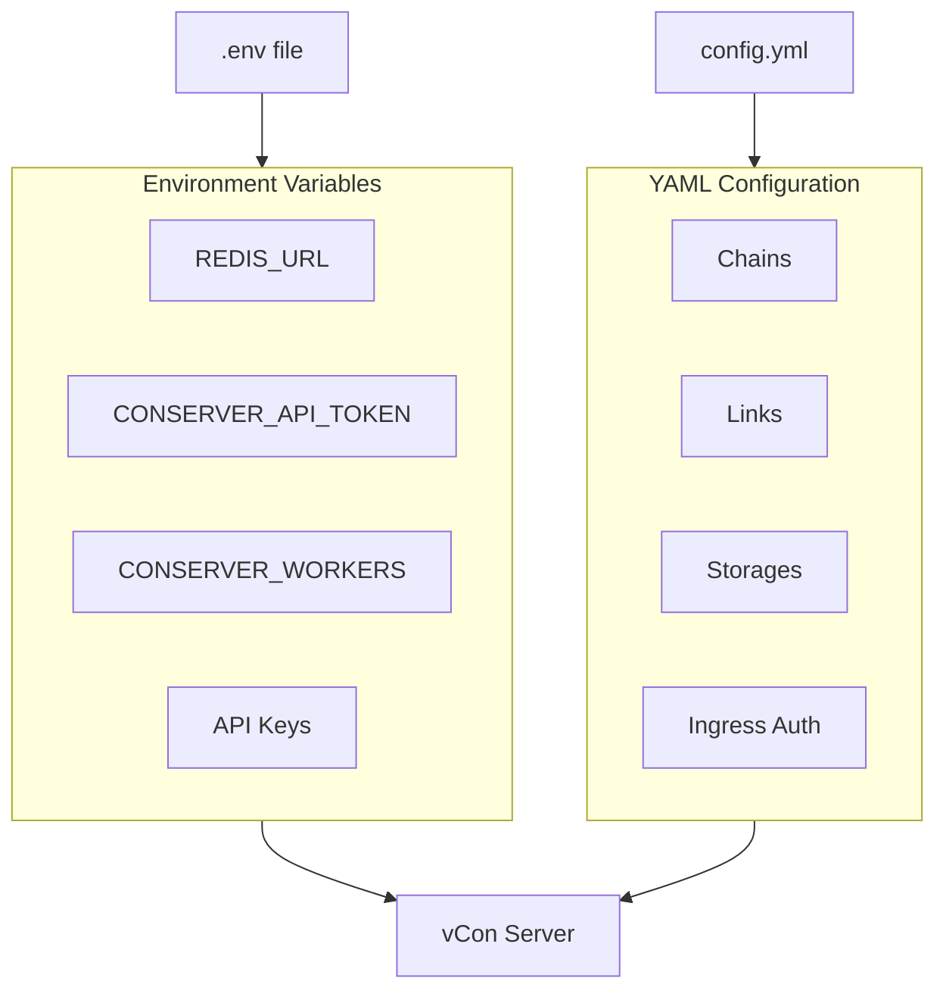

# Configuration Guide

vCon Server uses a two-tier configuration system:

1. **Environment Variables**: Server-level settings, API keys, worker configuration
2. **YAML Configuration**: Processing pipelines, storage backends, chains, and links

## Configuration Overview



## Quick Configuration

### Minimal Setup

**.env**:
```bash
REDIS_URL=redis://localhost:6379
CONSERVER_API_TOKEN=your-secure-token
```

**config.yml**:
```yaml
chains:
  simple_chain:
    links: []
    storages:
      - redis_storage
    ingress_lists:
      - default
    enabled: 1

storages:
  redis_storage:
    module: storage.redis_storage
```

### Production Setup

**.env**:
```bash
# Core Settings
REDIS_URL=redis://redis:6379
CONSERVER_API_TOKEN=your-production-token
ENV=production
LOG_LEVEL=INFO

# Worker Configuration
CONSERVER_WORKERS=4
CONSERVER_PARALLEL_STORAGE=true
CONSERVER_START_METHOD=fork

# AI Services
DEEPGRAM_KEY=your-deepgram-key
OPENAI_API_KEY=your-openai-key
```

**config.yml**:
```yaml
chains:
  production_chain:
    links:
      - transcribe
      - analyze
      - tag
    storages:
      - postgres
      - s3
    ingress_lists:
      - production
    egress_lists:
      - processed
    enabled: 1

links:
  transcribe:
    module: links.deepgram_link
    options:
      model: nova-2
  analyze:
    module: links.analyze
    options:
      model: gpt-4
  tag:
    module: links.tag
    options:
      tags: [processed]

storages:
  postgres:
    module: storage.postgres
    options:
      host: postgres
      database: vcon_server
  s3:
    module: storage.s3
    options:
      bucket: vcon-archive
```

## Configuration Sections

| Section | Documentation |
|---------|---------------|
| [Environment Variables](environment-variables.md) | All environment variables with defaults |
| [YAML Configuration](yaml-configuration.md) | Complete YAML structure reference |
| [Chains and Pipelines](chains-and-pipelines.md) | How to build processing pipelines |
| [Authentication](authentication.md) | API tokens and ingress authentication |
| [Workers](workers.md) | Multi-worker and parallel storage configuration |

## Configuration Loading

### Environment Variables

Environment variables are loaded at startup from:

1. System environment
2. `.env` file in the working directory
3. Docker Compose `env_file` directive

Priority: System environment > `.env` file

### YAML Configuration

The YAML configuration file location is specified by:

```bash
CONSERVER_CONFIG_FILE=./config.yml
```

Default: `./example_config.yml`

### Configuration Validation

The server validates configuration at startup:

```bash
# Check configuration
poetry run python -c "from server.config import get_config; import json; print(json.dumps(get_config(), indent=2))"
```

## Configuration Best Practices

### Security

1. **Never commit secrets** to version control
2. **Use environment variables** for sensitive data
3. **Rotate API tokens** regularly
4. **Use ingress-specific authentication** for external integrations

### Organization

1. **Separate environments** with different config files
2. **Use meaningful chain names** that describe their purpose
3. **Document custom links** with comments in YAML

### Performance

1. **Match workers to CPU cores** for I/O-bound workloads
2. **Enable parallel storage** when using multiple backends
3. **Use appropriate storage backends** for your access patterns

## Common Configurations

### Call Center Analytics

```yaml
chains:
  call_analytics:
    links:
      - deepgram_link      # Transcribe
      - analyze            # Extract insights
      - detect_engagement  # Measure customer engagement
      - tag_router         # Route by outcome
    storages:
      - postgres           # Queryable storage
      - elasticsearch      # Full-text search
    ingress_lists:
      - call_recordings
    enabled: 1
```

### Compliance Archive

```yaml
chains:
  compliance_archive:
    links:
      - transcribe
      - check_and_tag      # Apply compliance tags
    storages:
      - s3                 # Long-term archive
      - postgres           # Audit queries
    tracers:
      - jlinc              # Audit trail
    ingress_lists:
      - regulated_calls
    enabled: 1
```

### AI Knowledge Base

```yaml
chains:
  knowledge_base:
    links:
      - transcribe
      - analyze_and_label  # Extract topics and entities
    storages:
      - milvus             # Vector search
      - mongo              # Document storage
    ingress_lists:
      - knowledge_ingress
    enabled: 1
```

## Troubleshooting Configuration

### Configuration Not Loading

```bash
# Check file exists
ls -la $CONSERVER_CONFIG_FILE

# Validate YAML syntax
python -c "import yaml; yaml.safe_load(open('config.yml'))"
```

### Environment Variables Not Set

```bash
# Check current values
env | grep CONSERVER

# Debug in Python
python -c "from server import settings; print(settings.REDIS_URL)"
```

### Chain Not Processing

```yaml
chains:
  my_chain:
    enabled: 1  # Must be 1, not "true"
    ingress_lists:
      - my_list  # Must match where vCons are submitted
```

## Next Steps

- [Environment Variables](environment-variables.md) - Complete reference
- [YAML Configuration](yaml-configuration.md) - All configuration options
- [Chains and Pipelines](chains-and-pipelines.md) - Build processing workflows
