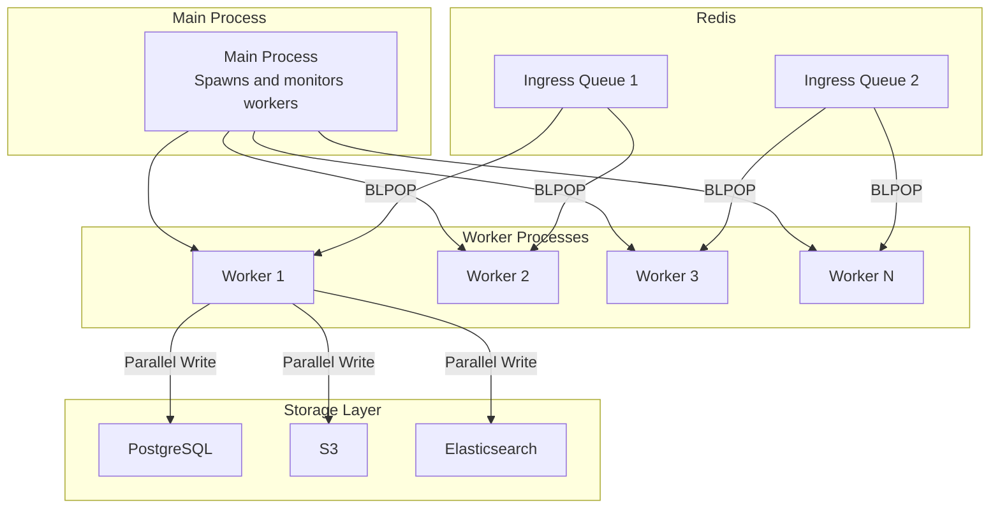

# Worker Configuration

vCon Server supports multi-worker processing for improved throughput and parallel storage writes for faster persistence.

## Architecture Overview



## Worker Configuration

### CONSERVER_WORKERS

Controls the number of worker processes.

```bash
# Single worker (default)
CONSERVER_WORKERS=1

# Multi-worker mode
CONSERVER_WORKERS=4
```

| Value | Mode | Use Case |
|-------|------|----------|
| `1` | Single worker | Development, low volume |
| `2-4` | Light parallel | Medium volume, limited resources |
| `4-8` | Standard parallel | Production workloads |
| `8-16` | High parallel | High-throughput systems |

### Sizing Guidelines

**I/O-Bound Workloads** (transcription, API calls):

```bash
# Match CPU cores
CONSERVER_WORKERS=$(nproc)
```

**CPU-Bound Workloads** (local processing):

```bash
# Leave 1 core for system
CONSERVER_WORKERS=$(($(nproc) - 1))
```

**Memory-Constrained Systems**:

```bash
# Each worker uses ~200-500MB
# For 8GB system with other services:
CONSERVER_WORKERS=4
```

## Parallel Storage

### CONSERVER_PARALLEL_STORAGE

Enables concurrent writes to multiple storage backends.

```bash
# Enable parallel storage (default)
CONSERVER_PARALLEL_STORAGE=true

# Disable for sequential writes
CONSERVER_PARALLEL_STORAGE=false
```

### Performance Impact

```
Without parallel storage (sequential):
  PostgreSQL: 100ms
  S3: 150ms
  Elasticsearch: 100ms
  Total: 350ms

With parallel storage (concurrent):
  All backends: ~150ms (max of individual times)
  Speedup: 2.3x
```

### When to Disable

Disable parallel storage if:

- Storage backends have interdependencies
- Debugging storage issues
- Resource constraints prevent concurrent connections

## Start Method

### CONSERVER_START_METHOD

Controls how worker processes are created.

```bash
# Memory-efficient (Unix only)
CONSERVER_START_METHOD=fork

# Safer, cross-platform
CONSERVER_START_METHOD=spawn

# Hybrid approach
CONSERVER_START_METHOD=forkserver

# Platform default
CONSERVER_START_METHOD=
```

### Comparison

| Method | Memory | Startup | Safety | Platform |
|--------|--------|---------|--------|----------|
| `fork` | Low (COW) | Fast | Lower | Unix only |
| `spawn` | Higher | Slower | Higher | All |
| `forkserver` | Medium | Medium | Medium | Unix |

### fork (Default on Unix)

```bash
CONSERVER_START_METHOD=fork
```

**How it works:**

- Creates worker by copying parent process (copy-on-write)
- Shares memory pages until modified
- Fast startup, low memory overhead

**Considerations:**

- Not safe with threads before fork
- Can cause issues with some libraries (OpenSSL, CUDA)
- Not available on Windows

**Best for:**

- Unix servers with stable libraries
- Memory-constrained environments
- Simple deployments

### spawn

```bash
CONSERVER_START_METHOD=spawn
```

**How it works:**

- Starts fresh Python interpreter for each worker
- No shared memory from parent
- All modules re-imported

**Considerations:**

- Higher memory usage
- Slower startup time
- Most compatible option

**Best for:**

- macOS deployments
- Windows systems
- When using CUDA, OpenSSL, or other sensitive libraries
- Maximum stability

### forkserver

```bash
CONSERVER_START_METHOD=forkserver
```

**How it works:**

- Spawns a clean "server" process at startup
- Workers are forked from the server
- Avoids issues with parent process state

**Considerations:**

- Middle ground between fork and spawn
- Only available on Unix
- Requires extra process

**Best for:**

- Balance of memory efficiency and safety
- When fork causes issues but spawn is too slow

## Worker Behavior

### Atomic Work Distribution

Workers use Redis BLPOP for atomic work distribution:

```
Worker 1: BLPOP queue1 queue2 ...
Worker 2: BLPOP queue1 queue2 ...
Worker N: BLPOP queue1 queue2 ...
```

Each vCon is processed by exactly one worker.

### Graceful Shutdown

On SIGTERM or SIGINT:

1. Main process signals all workers
2. Workers complete current vCon
3. Workers exit cleanly
4. Main process exits

```bash
# Graceful stop
docker compose stop  # Sends SIGTERM

# Force stop (after timeout)
docker compose kill  # Sends SIGKILL
```

### Auto-Restart

If a worker crashes:

1. Main process detects exit
2. New worker is spawned
3. Processing continues

```bash
# Check worker status
docker compose logs conserver | grep -i "worker"
```

## Configuration Examples

### Development

```bash
# Single worker, verbose logging
CONSERVER_WORKERS=1
CONSERVER_PARALLEL_STORAGE=true
LOG_LEVEL=DEBUG
```

### Production (Linux)

```bash
# Multi-worker, memory-efficient
CONSERVER_WORKERS=8
CONSERVER_PARALLEL_STORAGE=true
CONSERVER_START_METHOD=fork
LOG_LEVEL=INFO
```

### Production (macOS/Container)

```bash
# Multi-worker, safer start method
CONSERVER_WORKERS=4
CONSERVER_PARALLEL_STORAGE=true
CONSERVER_START_METHOD=spawn
LOG_LEVEL=INFO
```

### High-Throughput

```bash
# Maximum parallelism
CONSERVER_WORKERS=16
CONSERVER_PARALLEL_STORAGE=true
CONSERVER_START_METHOD=fork
TICK_INTERVAL=1000  # Check queues more frequently
```

### Memory-Constrained

```bash
# Balance workers with available memory
CONSERVER_WORKERS=2
CONSERVER_PARALLEL_STORAGE=true
CONSERVER_START_METHOD=fork  # Use COW memory
```

## Monitoring Workers

### Logs

```bash
# View worker startup
docker compose logs conserver | grep -i "worker"

# Watch for processing
docker compose logs -f conserver
```

### Metrics

Monitor these metrics:

- **Queue depth**: `redis-cli LLEN {ingress_list}`
- **Processing rate**: vCons processed per minute
- **Worker health**: Process count, restarts

### Health Check

```bash
# Check all workers are running
docker compose exec conserver ps aux | grep python

# Check queue processing
docker compose exec redis redis-cli LLEN default
```

## Troubleshooting

### Workers Not Starting

**Check logs:**

```bash
docker compose logs conserver
```

**Common causes:**

- Invalid start method for platform
- Insufficient memory
- Redis connection issues

### High Memory Usage

**Reduce workers:**

```bash
CONSERVER_WORKERS=2
```

**Use fork start method:**

```bash
CONSERVER_START_METHOD=fork
```

### Slow Processing

**Increase workers:**

```bash
CONSERVER_WORKERS=8
```

**Enable parallel storage:**

```bash
CONSERVER_PARALLEL_STORAGE=true
```

**Check external API latency:**

```bash
# Time transcription API
time curl -X POST https://api.deepgram.com/...
```

### Worker Crashes

**Check for library compatibility:**

```bash
# If using fork and seeing crashes
CONSERVER_START_METHOD=spawn
```

**Check resource limits:**

```bash
# Docker resource constraints
docker stats
```

### Inconsistent Processing

**Ensure atomic operations:**

- Workers use BLPOP (atomic pop)
- Each vCon processed once

**Check for duplicate processing:**

```bash
# Review logs for same UUID
docker compose logs conserver | grep "UUID"
```

## Scaling Strategies

### Vertical Scaling

Increase workers within single instance:

```bash
# Start with CPU cores
CONSERVER_WORKERS=$(nproc)

# Monitor and adjust
docker stats
```

### Horizontal Scaling

Run multiple instances:

```bash
# Docker Compose
docker compose up -d --scale conserver=4

# Each instance can have multiple workers
CONSERVER_WORKERS=2  # 4 instances x 2 workers = 8 total
```

### Auto-Scaling (Kubernetes)

```yaml
apiVersion: autoscaling/v2
kind: HorizontalPodAutoscaler
metadata:
  name: worker-hpa
spec:
  scaleTargetRef:
    apiVersion: apps/v1
    kind: Deployment
    name: worker
  minReplicas: 2
  maxReplicas: 10
  metrics:
    - type: Resource
      resource:
        name: cpu
        target:
          type: Utilization
          averageUtilization: 70
```
