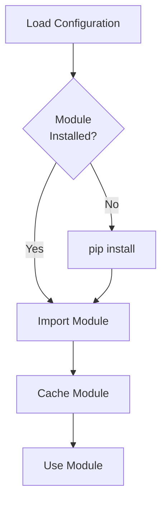

# Dynamic Modules

vCon Server can dynamically install and load modules from PyPI or GitHub at runtime.

## Overview

Dynamic modules allow you to:

- Use external processing links without modifying the codebase
- Share custom modules across deployments
- Install dependencies automatically

## Configuration

### From PyPI

```yaml
links:
  custom_link:
    module: custom_link_package.main
    pip_name: custom-link-package
    options:
      api_key: your-key
```

### From GitHub

```yaml
links:
  github_link:
    module: github_link.processor
    pip_name: git+https://github.com/username/repo.git
    options:
      setting: value
```

### From GitHub Branch/Tag

```yaml
links:
  dev_link:
    module: dev_link.main
    pip_name: git+https://github.com/username/repo.git@develop
    
  versioned_link:
    module: versioned_link.main
    pip_name: git+https://github.com/username/repo.git@v1.2.3
```

### From Private GitHub

```yaml
links:
  private_link:
    module: private_link.main
    pip_name: git+https://${GITHUB_TOKEN}@github.com/org/private-repo.git
```

## Import Configuration

Use the `imports` section to pre-load modules:

```yaml
imports:
  # Simple import
  requests_lib:
    module: requests
    
  # PyPI package
  custom_utils:
    module: custom_utils
    pip_name: custom-utils-package
    
  # GitHub repository
  shared_lib:
    module: shared_library
    pip_name: git+https://github.com/org/shared-lib.git
```

## How It Works



1. Server reads configuration
2. For each module with `pip_name`:
   - Check if module is already installed
   - If not, run `pip install {pip_name}`
3. Import the module
4. Cache for subsequent use

## Creating Distributable Modules

### Package Structure

```
my-vcon-link/
  setup.py
  pyproject.toml
  my_link/
    __init__.py
    processor.py
  README.md
```

### pyproject.toml

```toml
[build-system]
requires = ["setuptools>=61.0"]
build-backend = "setuptools.build_meta"

[project]
name = "my-vcon-link"
version = "1.0.0"
description = "Custom vCon processing link"
requires-python = ">=3.12"
dependencies = [
    "requests>=2.28.0",
]

[project.optional-dependencies]
dev = [
    "pytest>=7.0.0",
]
```

### Module Implementation

```python
# my_link/__init__.py

from lib.logging_utils import init_logger
from server.lib.vcon_redis import VconRedis

logger = init_logger(__name__)

default_options = {
    "setting": "default"
}

def run(vcon_uuid, link_name, opts=default_options):
    """Process vCon."""
    options = {**default_options, **opts}
    
    vcon_redis = VconRedis()
    vcon = vcon_redis.get_vcon(vcon_uuid)
    
    # Your processing logic
    
    vcon_redis.store_vcon(vcon)
    return vcon_uuid
```

### Publishing to PyPI

```bash
# Build
python -m build

# Upload to PyPI
python -m twine upload dist/*

# Or upload to private PyPI
python -m twine upload --repository-url https://pypi.example.com dist/*
```

### Publishing to GitHub

```bash
# Tag release
git tag v1.0.0
git push origin v1.0.0
```

## Environment Variables in pip_name

Use environment variables for secrets:

```yaml
links:
  private_link:
    module: private_link
    pip_name: git+https://${GITHUB_TOKEN}@github.com/org/repo.git
```

Set the environment variable:

```bash
export GITHUB_TOKEN=ghp_xxxxxxxxxxxx
```

## Version Pinning

Pin versions for reproducibility:

```yaml
# PyPI with version
links:
  stable_link:
    module: stable_link
    pip_name: stable-link-package==1.2.3

# GitHub with tag
links:
  tagged_link:
    module: tagged_link
    pip_name: git+https://github.com/org/repo.git@v1.2.3
```

## Troubleshooting

### Module Not Found

**Check pip installation:**

```bash
docker compose exec conserver pip list | grep my-package
```

**Manual install:**

```bash
docker compose exec conserver pip install my-package
```

### Import Errors

**Check module path:**

```python
# Verify module can be imported
docker compose exec conserver python -c "import my_module; print(my_module)"
```

**Check dependencies:**

```bash
docker compose exec conserver pip check
```

### GitHub Authentication

**For private repos:**

```bash
# Use personal access token
pip_name: git+https://TOKEN@github.com/org/repo.git

# Or use SSH (requires key setup)
pip_name: git+ssh://git@github.com/org/repo.git
```

### Version Conflicts

**Check for conflicts:**

```bash
docker compose exec conserver pip check
```

**Force reinstall:**

```bash
docker compose exec conserver pip install --force-reinstall my-package
```

## Best Practices

### 1. Pin Versions in Production

```yaml
# Good: Pinned version
pip_name: my-package==1.2.3

# Avoid: Unpinned (may break)
pip_name: my-package
```

### 2. Use Trusted Sources

```yaml
# Good: Official PyPI
pip_name: official-package

# Good: Verified GitHub
pip_name: git+https://github.com/trusted-org/repo.git@v1.0.0

# Avoid: Unverified sources
pip_name: git+https://github.com/random-user/suspicious-repo.git
```

### 3. Test Before Deployment

```bash
# Test installation
pip install my-package

# Test import
python -c "from my_package import run; print(run)"

# Test functionality
pytest tests/
```

### 4. Document Dependencies

Include in your module's README:

```markdown
## Requirements

- Python 3.12+
- vCon Server 1.1+

## Dependencies

- requests >= 2.28.0
- pydantic >= 2.0.0
```

### 5. Handle Missing Dependencies

```python
def run(vcon_uuid, link_name, opts=default_options):
    try:
        import optional_dependency
    except ImportError:
        logger.error("Optional dependency not installed")
        raise ImportError("Please install: pip install optional-dependency")
```

## Security Considerations

### 1. Verify Package Sources

Only use packages from trusted sources:

- Official PyPI packages
- Verified GitHub repositories
- Internal/private repositories

### 2. Review Code

Before using external modules:

- Review the source code
- Check for security issues
- Verify maintainer reputation

### 3. Use Private PyPI

For enterprise deployments:

```yaml
# Configure private PyPI
pip_name: my-package --index-url https://pypi.internal.example.com/simple/
```

### 4. Scan Dependencies

```bash
# Use safety to scan for vulnerabilities
pip install safety
safety check
```
