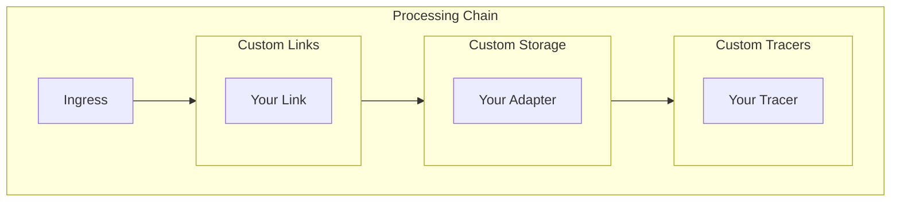

# Extending vCon Server

vCon Server is designed to be extended with custom processing links, storage adapters, and tracers.

## Extension Points



| Extension Type | Purpose | Interface |
|---------------|---------|-----------|
| [Links](creating-links.md) | Process/transform vCons | `run(vcon_uuid, link_name, opts)` |
| [Storage Adapters](creating-storage-adapters.md) | Persist vCons | `save(vcon_uuid, opts)`, `get(vcon_uuid, opts)` |
| [Tracers](creating-tracers.md) | Audit trails | `trace(vcon_uuid, event, opts)` |

## Quick Start

### Create a Custom Link

```python
# server/links/my_link/__init__.py

from lib.logging_utils import init_logger
from server.lib.vcon_redis import VconRedis

logger = init_logger(__name__)

default_options = {
    "my_option": "default_value"
}

def run(vcon_uuid, link_name, opts=default_options):
    """Process a vCon."""
    logger.info(f"Processing {vcon_uuid}")
    
    # Get vCon from Redis
    vcon_redis = VconRedis()
    vcon = vcon_redis.get_vcon(vcon_uuid)
    
    # Your processing logic here
    vcon.add_tag("processed_by", "my_link")
    
    # Save changes
    vcon_redis.store_vcon(vcon)
    
    return vcon_uuid  # Return UUID to continue chain
```

Register in `config.yml`:

```yaml
links:
  my_link:
    module: links.my_link

chains:
  my_chain:
    links:
      - my_link
    storages:
      - redis_storage
    ingress_lists:
      - default
    enabled: 1
```

### Create a Custom Storage Adapter

```python
# server/storage/my_storage/__init__.py

from lib.logging_utils import init_logger
from server.lib.vcon_redis import VconRedis

logger = init_logger(__name__)

default_options = {
    "connection_string": "localhost:1234"
}

def save(vcon_uuid, opts=default_options):
    """Save vCon to storage."""
    vcon_redis = VconRedis()
    vcon = vcon_redis.get_vcon(vcon_uuid)
    
    # Your storage logic here
    # e.g., write to database, file, API
    
    logger.info(f"Saved {vcon_uuid} to my_storage")

def get(vcon_uuid, opts=default_options):
    """Retrieve vCon from storage."""
    # Your retrieval logic here
    # Return dict or None if not found
    return None

def delete(vcon_uuid, opts=default_options):
    """Delete vCon from storage."""
    # Your deletion logic here
    return True
```

Register in `config.yml`:

```yaml
storages:
  my_storage:
    module: storage.my_storage
    options:
      connection_string: "mydb://localhost:5432"

chains:
  my_chain:
    storages:
      - my_storage
```

## Architecture Principles

### 1. Duck Typing

No base classes required. Implement the expected interface:

```python
# Links: run(vcon_uuid, link_name, opts) -> str | None
# Storage: save(vcon_uuid, opts), get(vcon_uuid, opts), delete(vcon_uuid, opts)
# Tracers: trace(vcon_uuid, event, opts)
```

### 2. Configuration-Driven

Extensions are registered via YAML configuration:

```yaml
links:
  my_link:
    module: links.my_link  # Python module path
    options:               # Passed to run()
      key: value
```

### 3. Dynamic Loading

Modules are imported at runtime:

1. Configuration specifies module path
2. Server imports module on first use
3. Module is cached for subsequent calls

### 4. External Packages

Install from PyPI or GitHub:

```yaml
links:
  external_link:
    module: external_module
    pip_name: external-package  # Auto-installed
    
imports:
  custom_utils:
    module: custom_utils
    pip_name: git+https://github.com/user/repo.git
```

## Development Workflow

### 1. Create Module

```bash
mkdir -p server/links/my_link
touch server/links/my_link/__init__.py
```

### 2. Implement Interface

```python
# server/links/my_link/__init__.py
default_options = {}

def run(vcon_uuid, link_name, opts=default_options):
    # Implementation
    return vcon_uuid
```

### 3. Add Tests

```python
# server/links/my_link/test_my_link.py
import pytest
from server.links.my_link import run

def test_run_returns_uuid():
    result = run("test-uuid", "my_link", {})
    assert result == "test-uuid"
```

### 4. Register in Config

```yaml
links:
  my_link:
    module: links.my_link
```

### 5. Test End-to-End

```bash
# Start services
docker compose up -d

# Submit test vCon
curl -X POST "http://localhost:8000/api/vcon?ingress_lists=default" \
  -H "x-conserver-api-token: $TOKEN" \
  -d '{"vcon": "0.0.1", "uuid": "test-123", ...}'

# Check logs
docker compose logs -f conserver
```

## Common Patterns

### Accessing vCon Data

```python
from server.lib.vcon_redis import VconRedis

vcon_redis = VconRedis()
vcon = vcon_redis.get_vcon(vcon_uuid)

# Access properties
uuid = vcon.uuid
parties = vcon.parties
dialog = vcon.dialog
analysis = vcon.analysis

# Modify vCon
vcon.add_tag("key", "value")
vcon.add_analysis(analysis_data)

# Save changes
vcon_redis.store_vcon(vcon)
```

### Filtering vCons

Return `None` to stop processing:

```python
def run(vcon_uuid, link_name, opts):
    vcon = VconRedis().get_vcon(vcon_uuid)
    
    # Filter based on criteria
    if should_filter(vcon):
        logger.info(f"Filtering {vcon_uuid}")
        return None  # Stop chain
    
    return vcon_uuid  # Continue chain
```

### Error Handling

```python
def run(vcon_uuid, link_name, opts):
    try:
        # Processing logic
        return vcon_uuid
    except TemporaryError as e:
        logger.warning(f"Temporary error: {e}")
        return None  # Skip, don't DLQ
    except Exception as e:
        logger.error(f"Error processing {vcon_uuid}: {e}")
        raise  # Send to DLQ
```

### External API Calls

```python
import requests
from tenacity import retry, stop_after_attempt, wait_exponential

@retry(stop=stop_after_attempt(3), wait=wait_exponential(multiplier=1, max=10))
def call_external_api(data):
    response = requests.post("https://api.example.com", json=data)
    response.raise_for_status()
    return response.json()

def run(vcon_uuid, link_name, opts):
    vcon = VconRedis().get_vcon(vcon_uuid)
    result = call_external_api(vcon.to_dict())
    # Process result
    return vcon_uuid
```

## Testing Extensions

### Unit Tests

```python
import pytest
from unittest.mock import MagicMock, patch

def test_my_link():
    with patch('server.lib.vcon_redis.VconRedis') as mock_redis:
        mock_vcon = MagicMock()
        mock_redis.return_value.get_vcon.return_value = mock_vcon
        
        from server.links.my_link import run
        result = run("test-uuid", "my_link", {})
        
        assert result == "test-uuid"
        mock_vcon.add_tag.assert_called()
```

### Integration Tests

```python
@pytest.mark.integration
def test_my_link_integration():
    # Requires running Redis
    from server.lib.vcon_redis import VconRedis
    from server.links.my_link import run
    
    # Create test vCon
    vcon_redis = VconRedis()
    # ... setup test data ...
    
    result = run("test-uuid", "my_link", {})
    
    # Verify results
    vcon = vcon_redis.get_vcon("test-uuid")
    assert "my_tag" in vcon.tags
```

## Next Steps

- [Creating Links](creating-links.md) - Detailed link development guide
- [Creating Storage Adapters](creating-storage-adapters.md) - Storage adapter guide
- [Creating Tracers](creating-tracers.md) - Tracer development guide
- [Dynamic Modules](dynamic-modules.md) - External module installation
