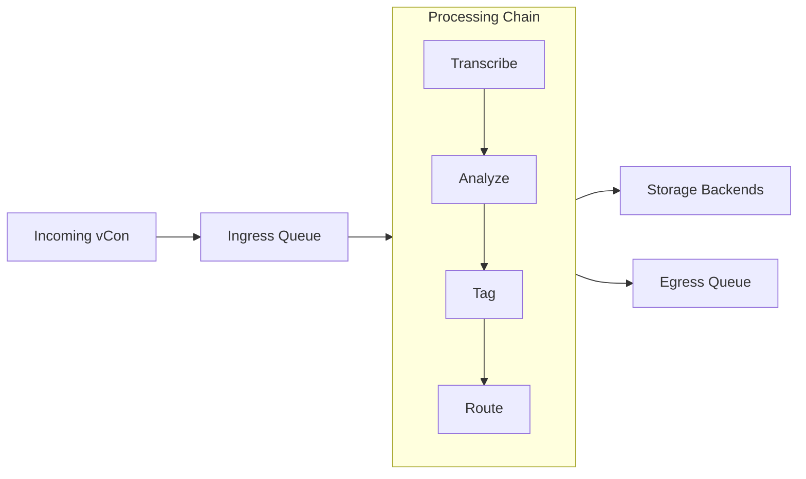

# Getting Started

Welcome to vCon Server! This section will help you understand what vCon Server does and get you up and running quickly.

## What is vCon Server?

vCon Server (also called "Conserver") is a processing pipeline for voice conversation data. It receives vCon (Voice Conversation) documents, processes them through configurable chains of operations, and stores them in one or more backends.

### The vCon Standard

A vCon is a standardized JSON format for representing voice conversations. It includes:

- **Parties**: Information about participants (phone numbers, emails, names)
- **Dialog**: The conversation content (audio files, transcripts)
- **Analysis**: AI-generated insights (summaries, sentiment, topics)
- **Attachments**: Related documents and files
- **Metadata**: Timestamps, UUIDs, and custom tags

### What vCon Server Does

1. **Receives vCons** via REST API or external integrations
2. **Queues them** in Redis for processing
3. **Processes them** through configurable chains of "links"
4. **Stores them** in one or more storage backends
5. **Routes them** to egress queues for downstream systems

## Key Concepts

### Chains

A **chain** is a complete processing pipeline that defines:

- **Ingress Lists**: Where vCons enter the chain
- **Links**: Processing steps executed in order
- **Storages**: Where processed vCons are persisted
- **Egress Lists**: Where vCons go after processing

### Links

**Links** are modular processors that transform or analyze vCons:

| Link Type | Examples |
|-----------|----------|
| Transcription | `deepgram_link`, `groq_whisper`, `hugging_face_whisper` |
| Analysis | `analyze`, `analyze_and_label`, `detect_engagement` |
| Tagging | `tag`, `check_and_tag` |
| Routing | `tag_router`, `sampler` |
| Integration | `webhook`, `post_analysis_to_slack` |

### Storage Adapters

**Storage adapters** persist vCons to various backends:

- **Databases**: PostgreSQL, MongoDB, Elasticsearch
- **Object Storage**: S3, local filesystem
- **Vector Databases**: Milvus (for similarity search)
- **Specialized**: SFTP, Dataverse, ChatGPT Files

## Use Cases

### Call Center Analytics

Process customer service calls to:

- Transcribe audio recordings
- Analyze sentiment and topics
- Detect customer engagement levels
- Route based on call outcome

### Compliance Recording

Archive voice communications with:

- Immutable storage in S3
- Full-text search in Elasticsearch
- Audit trails via tracers

### AI-Powered Insights

Extract value from conversations:

- Generate summaries and action items
- Classify calls by intent
- Build searchable knowledge bases

## Next Steps

1. **[System Requirements](requirements.md)**: Check what you need to run vCon Server
2. **[Quick Start](quick-start.md)**: Get running in 5 minutes with Docker
3. **[Installation Guide](../installation/index.md)**: Detailed installation options
