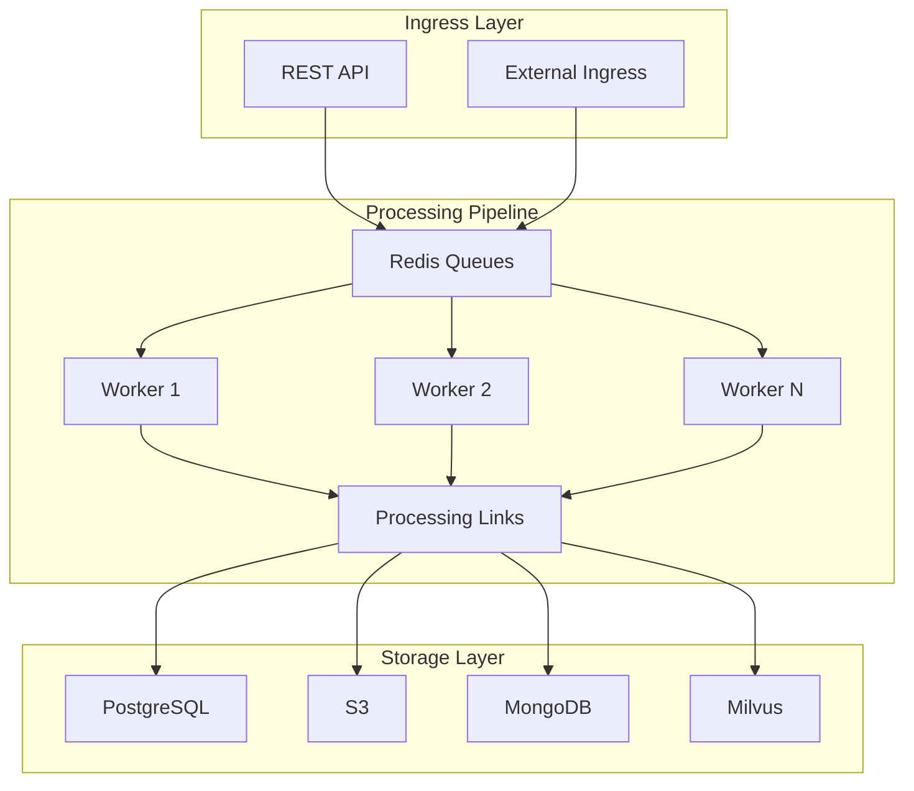

# vCon Server Documentation

Welcome to the official documentation for **vCon Server** (Conserver), a high-performance server for processing, storing, and managing vCon (Voice Conversation) data.

## What is vCon Server?

vCon Server is a pipeline-based processing system designed to handle voice conversation data at scale. It provides:

- **Flexible Processing Pipelines**: Chain-based architecture with modular processing links
- **Multi-Storage Support**: 10+ backend storage options with parallel write support
- **AI Integration**: Built-in transcription (Deepgram, Whisper) and analysis (OpenAI, Groq)
- **Scalable Architecture**: Multi-worker processing with configurable parallelism
- **Enterprise Ready**: Authentication, monitoring, and dead letter queue handling

## Quick Links

-   :material-rocket-launch:{ .lg .middle } **Getting Started**

    ---

    New to vCon Server? Start here for system requirements and a 5-minute quick start guide.

    [:octicons-arrow-right-24: Getting Started](getting-started/index.md)

-   :material-download:{ .lg .middle } **Installation**

    ---

    Multiple installation options: Docker, automated scripts, manual setup, or Kubernetes.

    [:octicons-arrow-right-24: Installation Guide](installation/index.md)

-   :material-cog:{ .lg .middle } **Configuration**

    ---

    Configure environment variables, YAML settings, processing chains, and authentication.

    [:octicons-arrow-right-24: Configuration](configuration/index.md)

-   :material-tools:{ .lg .middle } **Operations**

    ---

    API reference, monitoring, logging, troubleshooting, and maintenance procedures.

    [:octicons-arrow-right-24: Operations](operations/index.md)

-   :material-puzzle:{ .lg .middle } **Extending**

    ---

    Create custom processing links, storage adapters, and tracers.

    [:octicons-arrow-right-24: Extending](extending/index.md)

-   :material-book-open-variant:{ .lg .middle } **Reference**

    ---

    Complete reference for all links, storage adapters, and CLI options.

    [:octicons-arrow-right-24: Reference](reference/index.md)

## Architecture Overview

## Key Features

### Processing Pipeline

- **Chains**: Define processing workflows with ingress lists, links, storage, and egress
- **Links**: Modular processors for transcription, analysis, tagging, routing, and more
- **Filtering**: Links can filter vCons from the pipeline by returning `None`
- **Parallel Execution**: Multiple workers process vCons concurrently

### Storage Options

| Storage | Use Case |
|---------|----------|
| PostgreSQL | Relational queries, ACID compliance |
| MongoDB | Document storage, flexible schema |
| S3 | Archive storage, cost-effective |
| Elasticsearch | Full-text search |
| Milvus | Vector similarity search |
| File | Local development, simple deployments |

### AI Integrations

- **Transcription**: Deepgram, OpenAI Whisper, Groq Whisper, Hugging Face
- **Analysis**: OpenAI GPT models, custom analysis links
- **Embeddings**: OpenAI embeddings for vector storage

## Version Information

This documentation covers vCon Server v1.1, which includes:

- Multi-worker support with configurable worker processes
- Parallel storage writes for improved throughput
- Graceful shutdown handling
- Worker auto-restart capabilities

## Support

- **GitHub Issues**: [Report bugs or request features](https://github.com/vcon-dev/vcon-server/issues)
- **GitHub Discussions**: [Ask questions and share ideas](https://github.com/vcon-dev/vcon-server/discussions)
