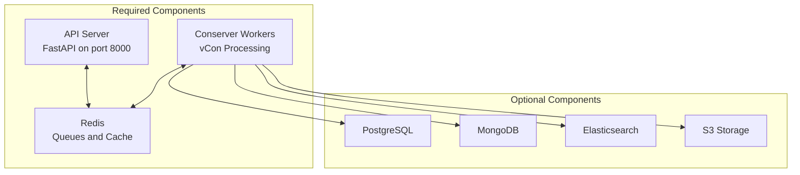

# Installation Guide

This section covers all methods for installing and deploying vCon Server.

## Installation Methods

Choose the installation method that best fits your needs:

| Method | Best For | Complexity |
|--------|----------|------------|
| [Docker](docker.md) | Production, most users | Low |
| [Automated Script](automated-script.md) | Quick production setup on Ubuntu | Low |
| [Manual Installation](manual-installation.md) | Development, customization | Medium |
| [Kubernetes](kubernetes.md) | Large scale, cloud native | High |

## Quick Comparison

### Docker (Recommended)

```bash
git clone https://github.com/vcon-dev/vcon-server.git
cd vcon-server
cp .env.example .env
cp example_docker-compose.yml docker-compose.yml
docker network create conserver
docker compose up -d --build
```

**Pros:**

- Consistent environment across systems
- Easy to scale with `docker compose up --scale`
- All dependencies included
- Simple upgrades

**Cons:**

- Requires Docker knowledge
- Container overhead

### Automated Script

```bash
sudo ./scripts/install_conserver.sh \
  --domain your-domain.com \
  --email admin@your-domain.com
```

**Pros:**

- One-command installation
- Sets up SSL, reverse proxy, and all services
- Production-ready configuration

**Cons:**

- Ubuntu Linux only
- Requires root access
- Less flexibility

### Manual Installation

```bash
poetry install
poetry run python ./server/main.py
```

**Pros:**

- Full control over configuration
- Best for development
- Easy debugging

**Cons:**

- More setup steps
- Must manage dependencies
- External Redis required

### Kubernetes

```bash
kubectl apply -f k8s/
```

**Pros:**

- Horizontal scaling
- Self-healing
- Cloud-native integration

**Cons:**

- Kubernetes expertise required
- More complex setup
- Higher resource overhead

## Architecture Overview

Regardless of installation method, vCon Server consists of these components:



### Required Components

1. **API Server**: FastAPI application serving the REST API
2. **Conserver Workers**: Background processes that execute chains
3. **Redis**: Message queue and caching layer

### Optional Components

Storage backends are optional and can be added based on your needs:

- **PostgreSQL**: Relational storage with full query support
- **MongoDB**: Document storage for flexible schemas
- **Elasticsearch**: Full-text search capabilities
- **S3**: Object storage for archival
- **Milvus**: Vector similarity search

## Pre-Installation Checklist

Before installing, ensure you have:

- [ ] Reviewed [System Requirements](../getting-started/requirements.md)
- [ ] Chosen an installation method
- [ ] Obtained any necessary API keys (Deepgram, OpenAI, etc.)
- [ ] Planned your storage backend strategy
- [ ] Allocated sufficient system resources

## Post-Installation Steps

After installation, you should:

1. **Verify the installation** by checking the health endpoint
2. **Configure authentication** with secure API tokens
3. **Set up monitoring** for production environments
4. **Configure backups** for your storage backends
5. **Review security settings** and firewall rules

## Next Steps

Choose your installation method:

- [Docker Installation](docker.md) - Recommended for most users
- [Automated Script](automated-script.md) - Quick Ubuntu production setup
- [Manual Installation](manual-installation.md) - Development and customization
- [Kubernetes](kubernetes.md) - Large scale deployments
