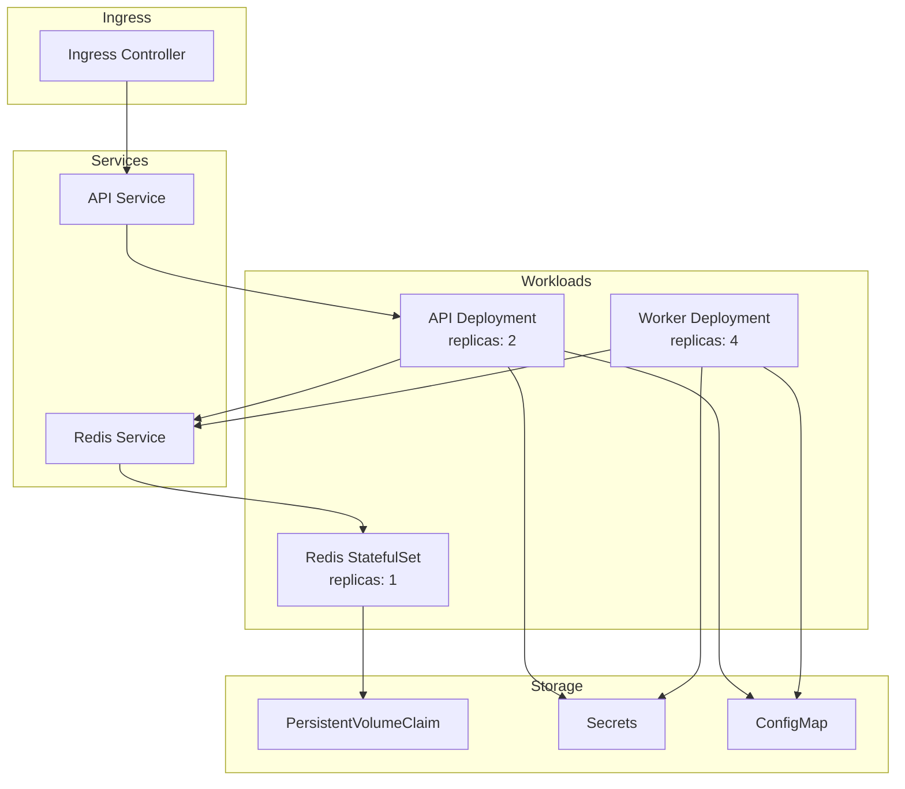

# Kubernetes Deployment

This guide covers deploying vCon Server on Kubernetes for scalable, production-grade deployments.

## Overview

Kubernetes deployment provides:

- Horizontal scaling with multiple replicas
- Self-healing with automatic restarts
- Rolling updates with zero downtime
- Resource management and limits
- Integration with cloud-native services

## Architecture



## Prerequisites

- Kubernetes cluster 1.24+
- kubectl configured
- Container registry access
- Persistent volume provisioner

## Deployment Files

Create a `k8s/` directory with the following manifests:

### Namespace

```yaml
# k8s/namespace.yaml
apiVersion: v1
kind: Namespace
metadata:
  name: vcon-server
```

### ConfigMap

```yaml
# k8s/configmap.yaml
apiVersion: v1
kind: ConfigMap
metadata:
  name: vcon-config
  namespace: vcon-server
data:
  config.yml: |
    chains:
      main_chain:
        links:
          - transcribe
          - analyze
          - tag
        storages:
          - redis_storage
        ingress_lists:
          - default
        enabled: 1
    
    links:
      transcribe:
        module: links.transcribe
      analyze:
        module: links.analyze
      tag:
        module: links.tag
    
    storages:
      redis_storage:
        module: storage.redis_storage
```

### Secrets

```yaml
# k8s/secrets.yaml
apiVersion: v1
kind: Secret
metadata:
  name: vcon-secrets
  namespace: vcon-server
type: Opaque
stringData:
  api-token: "your-secure-api-token"
  deepgram-key: "your-deepgram-key"
  openai-key: "your-openai-key"
```

!!! warning "Secret Management"
    In production, use a secrets management solution like:
    
    - HashiCorp Vault
    - AWS Secrets Manager
    - Azure Key Vault
    - Sealed Secrets

### Redis StatefulSet

```yaml
# k8s/redis.yaml
apiVersion: v1
kind: Service
metadata:
  name: redis
  namespace: vcon-server
spec:
  ports:
    - port: 6379
      targetPort: 6379
  selector:
    app: redis
---
apiVersion: apps/v1
kind: StatefulSet
metadata:
  name: redis
  namespace: vcon-server
spec:
  serviceName: redis
  replicas: 1
  selector:
    matchLabels:
      app: redis
  template:
    metadata:
      labels:
        app: redis
    spec:
      containers:
        - name: redis
          image: redis:7-alpine
          ports:
            - containerPort: 6379
          resources:
            requests:
              memory: "256Mi"
              cpu: "100m"
            limits:
              memory: "512Mi"
              cpu: "500m"
          volumeMounts:
            - name: redis-data
              mountPath: /data
  volumeClaimTemplates:
    - metadata:
        name: redis-data
      spec:
        accessModes: ["ReadWriteOnce"]
        resources:
          requests:
            storage: 10Gi
```

### API Deployment

```yaml
# k8s/api.yaml
apiVersion: v1
kind: Service
metadata:
  name: api
  namespace: vcon-server
spec:
  ports:
    - port: 8000
      targetPort: 8000
  selector:
    app: api
---
apiVersion: apps/v1
kind: Deployment
metadata:
  name: api
  namespace: vcon-server
spec:
  replicas: 2
  selector:
    matchLabels:
      app: api
  template:
    metadata:
      labels:
        app: api
    spec:
      containers:
        - name: api
          image: public.ecr.aws/r4g1k2s3/vcon-dev/vcon-server:latest
          command:
            - uvicorn
            - server.api:app
            - --host
            - "0.0.0.0"
            - --port
            - "8000"
          ports:
            - containerPort: 8000
          env:
            - name: REDIS_URL
              value: "redis://redis:6379"
            - name: CONSERVER_API_TOKEN
              valueFrom:
                secretKeyRef:
                  name: vcon-secrets
                  key: api-token
            - name: CONSERVER_CONFIG_FILE
              value: "/config/config.yml"
          volumeMounts:
            - name: config
              mountPath: /config
          resources:
            requests:
              memory: "256Mi"
              cpu: "100m"
            limits:
              memory: "512Mi"
              cpu: "500m"
          readinessProbe:
            httpGet:
              path: /api/health
              port: 8000
            initialDelaySeconds: 10
            periodSeconds: 5
          livenessProbe:
            httpGet:
              path: /api/health
              port: 8000
            initialDelaySeconds: 30
            periodSeconds: 10
      volumes:
        - name: config
          configMap:
            name: vcon-config
```

### Worker Deployment

```yaml
# k8s/worker.yaml
apiVersion: apps/v1
kind: Deployment
metadata:
  name: worker
  namespace: vcon-server
spec:
  replicas: 4
  selector:
    matchLabels:
      app: worker
  template:
    metadata:
      labels:
        app: worker
    spec:
      containers:
        - name: worker
          image: public.ecr.aws/r4g1k2s3/vcon-dev/vcon-server:latest
          command:
            - python
            - ./server/main.py
          env:
            - name: REDIS_URL
              value: "redis://redis:6379"
            - name: CONSERVER_API_TOKEN
              valueFrom:
                secretKeyRef:
                  name: vcon-secrets
                  key: api-token
            - name: CONSERVER_CONFIG_FILE
              value: "/config/config.yml"
            - name: CONSERVER_WORKERS
              value: "2"
            - name: CONSERVER_PARALLEL_STORAGE
              value: "true"
            - name: DEEPGRAM_KEY
              valueFrom:
                secretKeyRef:
                  name: vcon-secrets
                  key: deepgram-key
                  optional: true
            - name: OPENAI_API_KEY
              valueFrom:
                secretKeyRef:
                  name: vcon-secrets
                  key: openai-key
                  optional: true
          volumeMounts:
            - name: config
              mountPath: /config
          resources:
            requests:
              memory: "512Mi"
              cpu: "250m"
            limits:
              memory: "1Gi"
              cpu: "1000m"
      volumes:
        - name: config
          configMap:
            name: vcon-config
      terminationGracePeriodSeconds: 60
```

### Ingress

```yaml
# k8s/ingress.yaml
apiVersion: networking.k8s.io/v1
kind: Ingress
metadata:
  name: vcon-ingress
  namespace: vcon-server
  annotations:
    kubernetes.io/ingress.class: nginx
    cert-manager.io/cluster-issuer: letsencrypt-prod
spec:
  tls:
    - hosts:
        - vcon.example.com
      secretName: vcon-tls
  rules:
    - host: vcon.example.com
      http:
        paths:
          - path: /api
            pathType: Prefix
            backend:
              service:
                name: api
                port:
                  number: 8000
```

### Horizontal Pod Autoscaler

```yaml
# k8s/hpa.yaml
apiVersion: autoscaling/v2
kind: HorizontalPodAutoscaler
metadata:
  name: worker-hpa
  namespace: vcon-server
spec:
  scaleTargetRef:
    apiVersion: apps/v1
    kind: Deployment
    name: worker
  minReplicas: 2
  maxReplicas: 10
  metrics:
    - type: Resource
      resource:
        name: cpu
        target:
          type: Utilization
          averageUtilization: 70
```

## Deployment Steps

### Step 1: Apply Manifests

```bash
# Create namespace
kubectl apply -f k8s/namespace.yaml

# Apply configurations
kubectl apply -f k8s/configmap.yaml
kubectl apply -f k8s/secrets.yaml

# Deploy services
kubectl apply -f k8s/redis.yaml
kubectl apply -f k8s/api.yaml
kubectl apply -f k8s/worker.yaml

# Configure ingress
kubectl apply -f k8s/ingress.yaml

# Optional: Enable autoscaling
kubectl apply -f k8s/hpa.yaml
```

### Step 2: Verify Deployment

```bash
# Check pod status
kubectl get pods -n vcon-server

# Check services
kubectl get svc -n vcon-server

# Check logs
kubectl logs -f deployment/worker -n vcon-server

# Test API
kubectl port-forward svc/api 8000:8000 -n vcon-server
curl http://localhost:8000/api/health
```

## Scaling

### Manual Scaling

```bash
# Scale workers
kubectl scale deployment/worker --replicas=8 -n vcon-server

# Scale API
kubectl scale deployment/api --replicas=4 -n vcon-server
```

### Automatic Scaling

The HPA automatically scales based on CPU utilization. Customize thresholds:

```yaml
metrics:
  - type: Resource
    resource:
      name: cpu
      target:
        type: Utilization
        averageUtilization: 70
  - type: Resource
    resource:
      name: memory
      target:
        type: Utilization
        averageUtilization: 80
```

## Monitoring

### Prometheus Metrics

Add annotations for Prometheus scraping:

```yaml
metadata:
  annotations:
    prometheus.io/scrape: "true"
    prometheus.io/port: "8000"
    prometheus.io/path: "/metrics"
```

### Logging

Configure centralized logging:

```yaml
spec:
  containers:
    - name: worker
      env:
        - name: LOG_FORMAT
          value: "json"
```

## Cloud-Specific Configurations

### AWS EKS

```yaml
# Use AWS Load Balancer Controller
metadata:
  annotations:
    kubernetes.io/ingress.class: alb
    alb.ingress.kubernetes.io/scheme: internet-facing
    alb.ingress.kubernetes.io/target-type: ip
```

### Google GKE

```yaml
# Use Google Cloud Load Balancer
metadata:
  annotations:
    kubernetes.io/ingress.class: gce
    kubernetes.io/ingress.global-static-ip-name: vcon-ip
```

### Azure AKS

```yaml
# Use Azure Application Gateway
metadata:
  annotations:
    kubernetes.io/ingress.class: azure/application-gateway
```

## Troubleshooting

### Pods Not Starting

```bash
# Check pod status
kubectl describe pod <pod-name> -n vcon-server

# Check events
kubectl get events -n vcon-server --sort-by='.lastTimestamp'
```

### Connection Issues

```bash
# Test Redis connectivity
kubectl exec -it deployment/api -n vcon-server -- redis-cli -h redis ping

# Check service endpoints
kubectl get endpoints -n vcon-server
```

### Resource Issues

```bash
# Check resource usage
kubectl top pods -n vcon-server

# Check node resources
kubectl describe nodes
```

## Next Steps

- [Configuration Guide](../configuration/index.md) - Customize settings
- [Monitoring](../operations/monitoring.md) - Set up observability
- [Scaling](../configuration/workers.md) - Optimize performance
