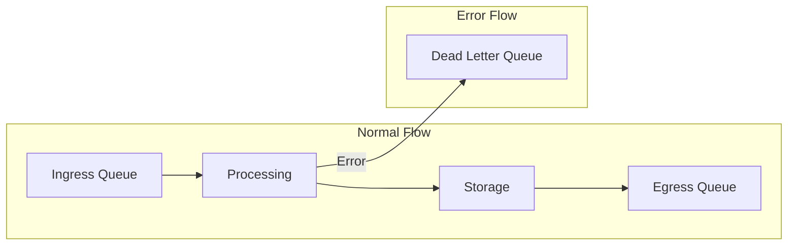
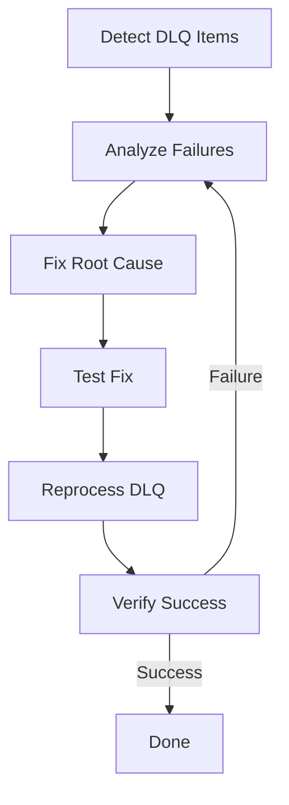

# Dead Letter Queue

The Dead Letter Queue (DLQ) captures vCons that fail processing, allowing for analysis and retry.

## How DLQ Works



When processing fails:

1. Error is logged with full traceback
2. vCon UUID is moved to DLQ
3. Original ingress list is recorded
4. Processing continues with next vCon

## DLQ Naming

Each ingress list has its own DLQ:

```
DLQ:{ingress_list_name}
```

Examples:

- `default` -> `DLQ:default`
- `production` -> `DLQ:production`
- `partner_input` -> `DLQ:partner_input`

## Managing the DLQ

### View DLQ Contents

```bash
# Via API
curl "http://localhost:8000/api/dlq?ingress_list=default" \
  -H "x-conserver-api-token: $TOKEN"
```

Response:

```json
{
  "uuids": ["uuid-1", "uuid-2", "uuid-3"],
  "count": 3,
  "dlq_name": "DLQ:default"
}
```

### Check DLQ Depth

```bash
# Via Redis
docker compose exec redis redis-cli LLEN DLQ:default
```

### View DLQ Items Directly

```bash
# List all items (0 to -1 = all)
docker compose exec redis redis-cli LRANGE DLQ:default 0 -1
```

### Reprocess DLQ

Move items back to the ingress queue for retry:

```bash
curl -X POST "http://localhost:8000/api/dlq/reprocess?ingress_list=default" \
  -H "x-conserver-api-token: $TOKEN"
```

Response:

```json
{
  "reprocessed": 3,
  "ingress_list": "default"
}
```

### Remove Single Item

```bash
# Remove specific UUID from DLQ
docker compose exec redis redis-cli LREM DLQ:default 1 "uuid-to-remove"
```

### Clear Entire DLQ

```bash
# Delete the DLQ list
docker compose exec redis redis-cli DEL DLQ:default
```

!!! warning "Data Loss"
    Clearing the DLQ permanently removes failed vCons. Ensure you've investigated the failures first.

## Analyzing Failures

### 1. Check Processing Logs

```bash
# Find errors for specific UUID
docker compose logs conserver | grep "uuid-from-dlq"

# Find all errors
docker compose logs conserver | grep -i "error\|exception\|failed"
```

### 2. Inspect the vCon

```bash
# Get the vCon data
curl "http://localhost:8000/api/vcon/uuid-from-dlq" \
  -H "x-conserver-api-token: $TOKEN" | jq .
```

### 3. Common Failure Patterns

| Error | Cause | Solution |
|-------|-------|----------|
| Connection refused | External service down | Check service, retry |
| Invalid API key | Wrong or expired key | Update credentials |
| Timeout | Slow external service | Increase timeout, retry |
| JSON decode error | Malformed vCon | Fix vCon data |
| Module not found | Missing dependency | Install module |

## Preventing DLQ Items

### 1. Validate Input

Check vCons before submission:

```python
import json

def validate_vcon(vcon):
    required = ['vcon', 'uuid', 'created_at', 'parties', 'dialog']
    for field in required:
        if field not in vcon:
            raise ValueError(f"Missing required field: {field}")
    return True
```

### 2. Use Appropriate Timeouts

Configure timeouts in links:

```yaml
links:
  deepgram_link:
    module: links.deepgram_link
    options:
      timeout: 120  # seconds
```

### 3. Handle Partial Failures

Use try/except in custom links:

```python
def run(vcon_uuid, link_name, opts):
    try:
        # Processing logic
        return vcon_uuid
    except TemporaryError:
        # Log and return None (skip, don't DLQ)
        logger.warning(f"Temporary error for {vcon_uuid}, skipping")
        return None
    except PermanentError:
        # Re-raise to send to DLQ
        raise
```

### 4. Monitor DLQ Depth

Set up alerts for DLQ growth:

```yaml
# prometheus-alerts.yml
- alert: DLQNotEmpty
  expr: redis_list_length{list=~"DLQ:.*"} > 0
  for: 5m
  labels:
    severity: warning
```

## DLQ Workflow

### Standard Recovery Process



### Step-by-Step

1. **Detect**: Alert on DLQ depth > 0
2. **Analyze**: Review logs, identify pattern
3. **Fix**: Address root cause (config, code, external service)
4. **Test**: Submit test vCon, verify processing
5. **Reprocess**: Move DLQ items back to ingress
6. **Verify**: Ensure items process successfully

### Scripted Recovery

```bash
#!/bin/bash
# dlq-recovery.sh

INGRESS_LIST="${1:-default}"
API_URL="http://localhost:8000/api"
TOKEN="${CONSERVER_API_TOKEN}"

# Check DLQ depth
echo "Checking DLQ for $INGRESS_LIST..."
DEPTH=$(docker compose exec -T redis redis-cli LLEN "DLQ:$INGRESS_LIST")
echo "DLQ depth: $DEPTH"

if [ "$DEPTH" -eq 0 ]; then
    echo "DLQ is empty"
    exit 0
fi

# Get sample of failed UUIDs
echo "Sample failed UUIDs:"
docker compose exec -T redis redis-cli LRANGE "DLQ:$INGRESS_LIST" 0 4

# Prompt for action
read -p "Reprocess DLQ? (y/n) " -n 1 -r
echo

if [[ $REPLY =~ ^[Yy]$ ]]; then
    echo "Reprocessing..."
    curl -X POST "$API_URL/dlq/reprocess?ingress_list=$INGRESS_LIST" \
      -H "x-conserver-api-token: $TOKEN"
    echo
    echo "Done. Monitor processing with: docker compose logs -f conserver"
fi
```

## Tracer Integration

When using tracers with DLQ handling:

```yaml
tracers:
  jlinc:
    module: tracers.jlinc
    options:
      dlq_vcon_on_error: true  # Send to DLQ on tracer error
```

## Best Practices

### 1. Don't Ignore the DLQ

- Monitor DLQ depth continuously
- Investigate failures promptly
- Don't let items accumulate

### 2. Fix Root Causes

- Don't just reprocess blindly
- Understand why failures occurred
- Prevent recurrence

### 3. Test Before Bulk Reprocess

```bash
# Move one item for testing
docker compose exec redis redis-cli RPOPLPUSH DLQ:default default

# Check processing
docker compose logs -f conserver

# If successful, reprocess rest
curl -X POST ".../dlq/reprocess?ingress_list=default" ...
```

### 4. Consider Retry Limits

For persistent failures:

```bash
# Check how many times an item has been reprocessed
# (Implement custom tracking if needed)
```

### 5. Archive Unrecoverable Items

```bash
# Move to archive queue instead of deleting
docker compose exec redis redis-cli RPOPLPUSH DLQ:default ARCHIVE:default
```
